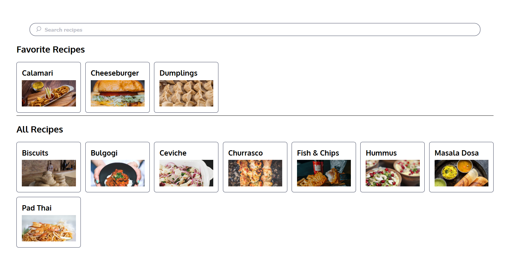

# Coders Store

A simple food website to understand the flow of REACT-REDUX

Check it live here: https://ashutosh-874.github.io/recipe_store/

### Installation

1 - Setup the Project

```bash
git clone https://github.com/ashutosh-874/recipe_store.git
cd recipe_store
```

2 - Install Dependencies

```bash
npm install
```

3 - Runserver on port 3000

```bash
npm start
```


